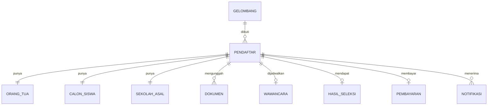

# Data Model — PPDB App

Dasar model ini diambil dari alur yang sudah ada di `ppdb-app (1).html` (mockup PPDB
SMA Cendekia Nusantara). **Keputusan:** satu sekolah per deployment (bukan platform
multi-tenant) — jadi `Sekolah` bukan parent yang di-FK oleh entitas lain, melainkan
satu baris pengaturan tunggal yang dibaca langsung oleh aplikasi.

## Ringkasan Entitas

`SEKOLAH` dan `ADMIN_USER` sengaja tidak digambar dengan relasi FK — `Sekolah` adalah
baris pengaturan tunggal (lihat §1), dan `AdminUser` berdiri sendiri tanpa perlu
`sekolah_id` karena hanya ada satu sekolah dalam deployment ini.

## 1. Sekolah (pengaturan tunggal — single-row table)
Bukan tabel multi-baris. Diperlakukan seperti tabel "settings": selalu tepat satu baris,
supaya admin bisa mengubah nama/alamat/tahun ajaran lewat panel admin tanpa redeploy.
(Alternatif yang lebih sederhana: simpan sebagai config/env alih-alih tabel DB — pilih
tabel kalau nilai ini perlu diubah dari UI, pilih env kalau cukup diubah manual per tahun.)

| Field | Tipe | Keterangan |
|---|---|---|
| id | PK | selalu 1 baris |
| npsn | string | Nomor Pokok Sekolah Nasional |
| nama | string | |
| jenjang | enum: SD, SMP, SMA, SMK | jenjang yang dibuka sekolah ini |
| alamat | text | |
| tahun_ajaran | string | contoh: "2026/2027" |
| updated_at | timestamp | |

## 2. Gelombang
Periode pendaftaran (early bird, tahap 1, dst).

| Field | Tipe | Keterangan |
|---|---|---|
| id | PK | |
| kode | string, unique | slug: `early_bird`, `tahap1`, `tahap2`, `tahap_akhir` |
| label | string | nama tampilan |
| tanggal_mulai / tanggal_selesai | date | |
| kuota | int | |
| biaya_ppdb | decimal | nominal tagihan untuk gelombang ini |
| urutan | int | urutan tampil |
| aktif | bool | gelombang yang sedang dibuka |

## 3. Pendaftar (entitas pusat)
Satu baris = satu pendaftaran. Nomor pendaftaran dipakai sebagai ID publik
(format `PPDB-{tahun}-{6 digit}`), yang lain nempel ke sini lewat relasi 1:1 / 1:N.

| Field | Tipe | Keterangan |
|---|---|---|
| id / nomor_pendaftaran | PK, string | contoh: `PPDB-2026-000123` |
| gelombang_id | FK → Gelombang | |
| created_at | timestamp | |

> **Catatan desain:** status/tahapan (`lengkapi_dokumen`, `menunggu_verifikasi`, dst)
> **tidak disimpan sebagai kolom.** Di mockup, status dihitung (`computeStage()`) dari
> kombinasi field lain: apakah semua dokumen sudah diunggah/terverifikasi, apakah
> wawancara sudah dijadwalkan, apakah hasil sudah ditetapkan, apakah pembayaran lunas.
> Ini menghindari state yang bisa jadi tidak sinkron dengan data aslinya. Pertahankan
> pola ini di backend (hitung stage dari relasi, jangan duplikasi di kolom `status`).
>
> 11 kemungkinan stage tampilan: `lengkapi_dokumen`, `menunggu_verifikasi`,
> `menunggu_jadwal`, `menunggu_wawancara`, `menunggu_hasil`, `tidak_diterima`,
> `cadangan`, `menunggu_pembayaran`, `menunggu_konfirmasi_bayar`, `lunas`, `siswa_aktif`.

## 4. Orang Tua / Wali (1:1 dengan Pendaftar)

| Field | Tipe | Keterangan |
|---|---|---|
| pendaftar_id | FK/PK | |
| nama | string | |
| nik | string(16) | validasi 16 digit numerik |
| hubungan | enum: ayah, ibu, wali | |
| no_hp | string | |
| email | string | |
| alamat | text | |

## 5. Calon Siswa (1:1 dengan Pendaftar)

| Field | Tipe | Keterangan |
|---|---|---|
| pendaftar_id | FK/PK | |
| nama | string | |
| jenjang_tujuan | enum: SD, SMP, SMA | |
| tempat_lahir | string | |
| tanggal_lahir | date | |
| jenis_kelamin | enum: L, P | |
| nisn | string, nullable | opsional |
| alamat_sama_dengan_ortu | bool | |
| alamat | text, nullable | diisi hanya jika tidak sama dengan alamat ortu |

## 6. Sekolah Asal (1:1 dengan Pendaftar)
Teks bebas — bukan FK ke tabel `Sekolah` (sekolah asal umumnya di luar platform ini).

| Field | Tipe | Keterangan |
|---|---|---|
| pendaftar_id | FK/PK | |
| nama_sekolah | string | |
| jenjang | enum: TK/PAUD, SD, SMP | |
| tahun_lulus | string | tahun lulus / perkiraan lulus |

## 7. Dokumen (1:N dengan Pendaftar)
Satu baris per jenis dokumen wajib.

| Field | Tipe | Keterangan |
|---|---|---|
| id | PK | |
| pendaftar_id | FK → Pendaftar | |
| jenis | enum: `kk`, `akta`, `ijazah`, `foto` | KK, Akta Kelahiran, Ijazah/SKL, Pas Foto 3x4 |
| file_url | string | |
| status | enum: belum_upload, menunggu_verifikasi, terverifikasi, ditolak | |
| catatan_verifikasi | text, nullable | alasan jika ditolak |
| uploaded_at / verified_at | timestamp, nullable | |

## 8. Wawancara (0/1:1 dengan Pendaftar)

| Field | Tipe | Keterangan |
|---|---|---|
| pendaftar_id | FK/PK | |
| tanggal | date | |
| jam | time | |
| lokasi | string | |

## 9. Hasil Seleksi (0/1:1 dengan Pendaftar)

| Field | Tipe | Keterangan |
|---|---|---|
| pendaftar_id | FK/PK | |
| hasil | enum: diterima, tidak_diterima, cadangan | |
| ditetapkan_at | timestamp | |
| ditetapkan_oleh | FK → AdminUser | |

## 10. Pembayaran (0/1:1 dengan Pendaftar)

| Field | Tipe | Keterangan |
|---|---|---|
| pendaftar_id | FK/PK | |
| jumlah_tagihan | decimal | disalin dari `Gelombang.biaya_ppdb` saat hasil diterima |
| status | enum: menunggu_pembayaran, menunggu_konfirmasi, lunas | |
| bukti_transfer_url | string, nullable | |
| dikonfirmasi_at / dikonfirmasi_oleh | timestamp / FK, nullable | |

## 11. Notifikasi (1:N dengan Pendaftar)
Log riwayat notifikasi (simulasi WA & Email di mockup).

| Field | Tipe | Keterangan |
|---|---|---|
| id | PK | |
| pendaftar_id | FK → Pendaftar | |
| judul | string | |
| pesan | text | |
| channel | enum: wa, email | |
| dikirim_at | timestamp | |

## 12. Admin User (baru, belum ada di mockup — dibutuhkan untuk auth nyata)
Mockup pakai satu password statis (`admin123`) tanpa akun individual — perlu digantikan
dengan akun sungguhan sebelum production. Tidak butuh `sekolah_id` (satu sekolah per
deployment).

| Field | Tipe | Keterangan |
|---|---|---|
| id | PK | |
| nama | string | |
| email | string, unique | |
| password_hash | string | |
| role | enum: panitia, superadmin | |

## Keputusan stack
**PHP (native) + Bootstrap + MySQL.** Tabel di atas akan diterjemahkan langsung jadi
`CREATE TABLE` MySQL (lihat `docs/schema.sql`, langkah berikutnya).

## Belum diputuskan / perlu keputusan berikutnya
- **Penyimpanan file dokumen** — lokal (folder `uploads/` di server), atau storage lain?
